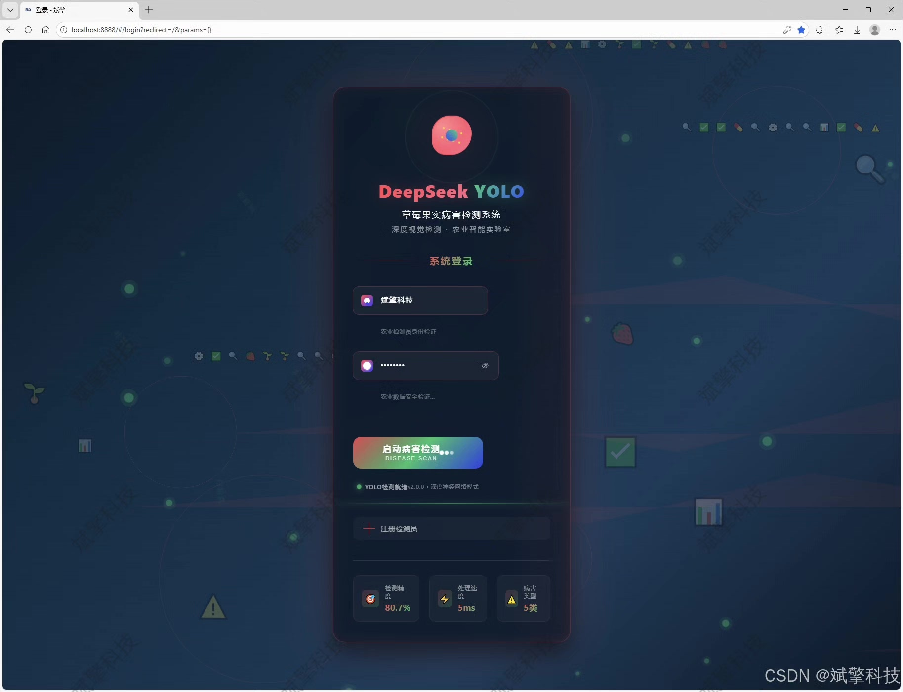
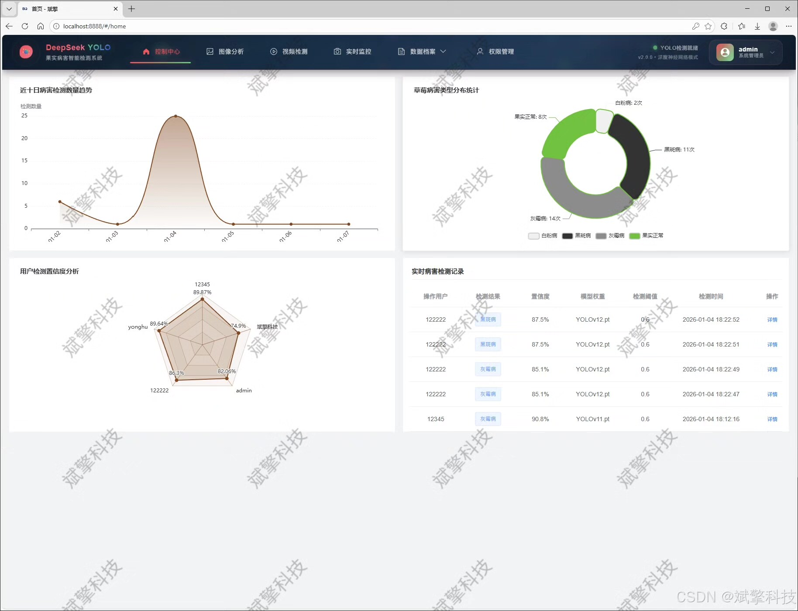
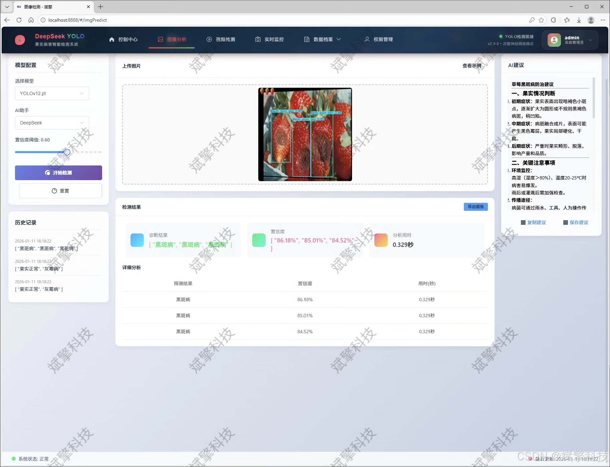
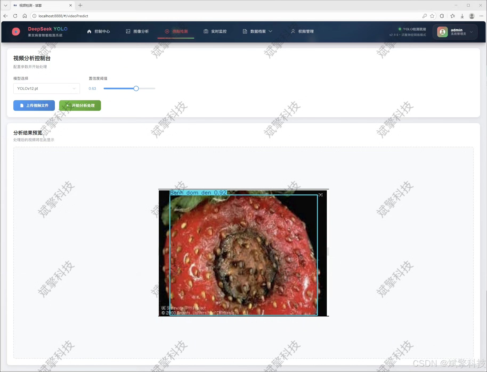
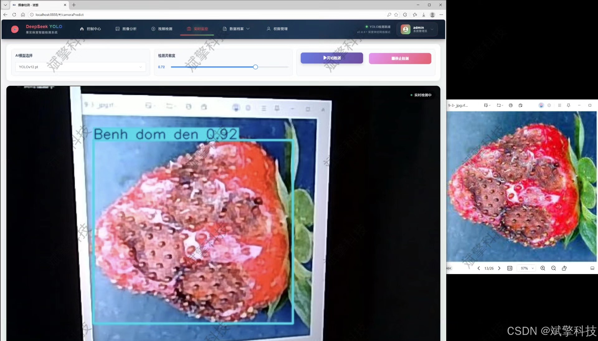
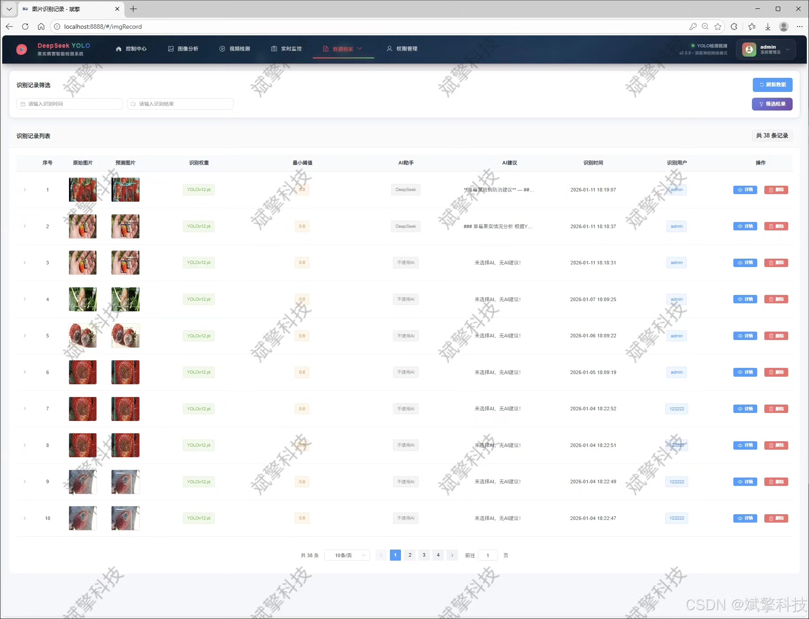
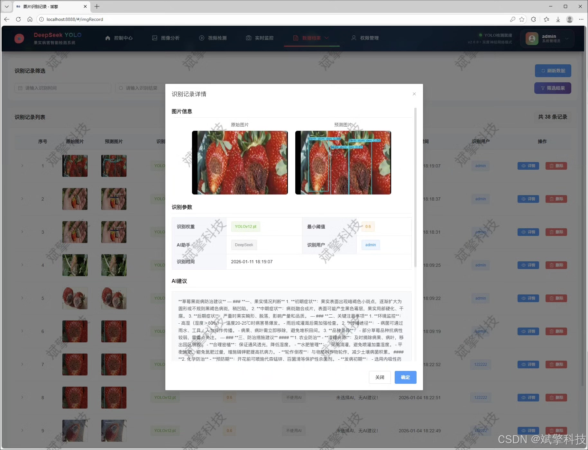
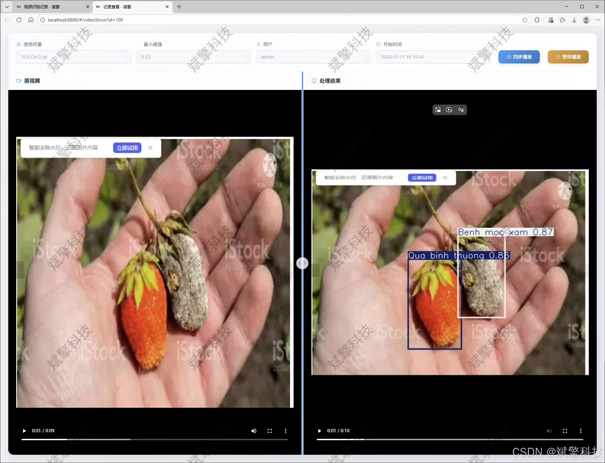
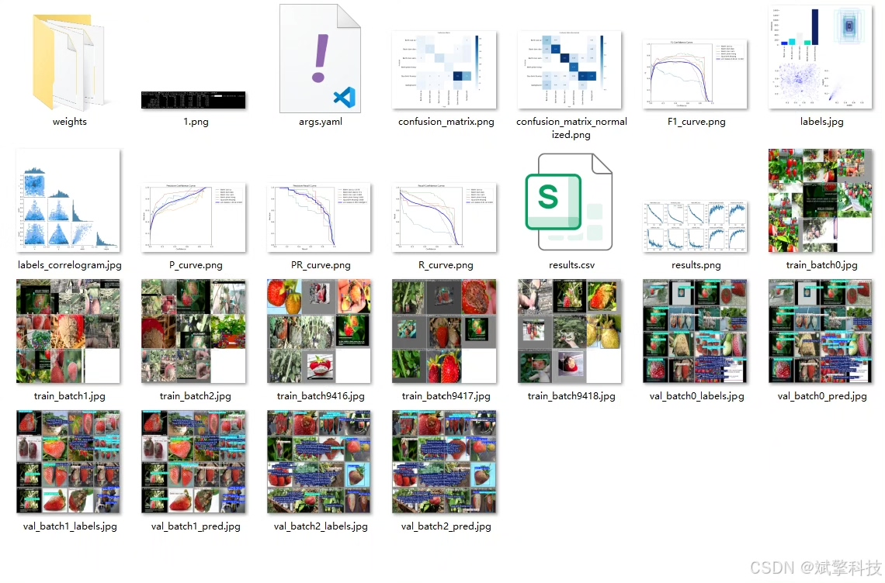

# YOLO+DeepSeek strawberry disease detection

## Body

YOLO+DeepSeek strawberry disease detection system based on YOLO deep learning and the large model of Qianwen and DeepSeek. (DeepSeek intelligent analysis + web interaction interface + front-end separation + YOLO data + YOLOv8/YOLOv10/YOLOv11/YOLOv12)

This paper designs and implements a strawberry disease intelligent detection and analysis system that integrates cutting-edge deep learning target detection technology with modern web development frameworks. The system aims to solve the difficult problem of rapid and accurate identification and management of strawberry diseases in agricultural production, and enhance the level of intelligence in disease prevention and control.

The system core utilizes four state-of-the-art single-stage object detection models: YOLOv8, YOLOv10, YOLOv11, and YOLOv12, as the detection engine. It has built a high-precision and efficient strawberry disease identification model. The model was trained and optimized on a self-constructed dataset containing 5 categories of strawberry states (normal fruits and four common diseases). This dataset consists of 884 images, which were strictly divided into training set (700), validation set (81), and test set (103) to ensure the scientific nature of the model evaluation. The detection categories include: Benh cao su (anthracnose), Benh dom den (black spot disease), Benh moc xam (gray mold disease), Benh phan trang (powdery mildew), and Qua binh thuong (normal fruit).
The backend service is built based on the SpringBoot framework, adopting a front-end-back-end separation architecture pattern, ensuring the system's high cohesion, low coupling, and good maintainability. Data persistence uses MySQL database for storing user information, system logs, and all detection records. The frontend Web interaction interface is designed intuitively and friendly, providing rich interactive functions.

The system is comprehensive, covering the entire process from user interaction to intelligent analysis: (1) User management: It implements a secure user login and registration mechanism; administrators have complete rights to add, delete, modify, and view users; users can manage their personal information, avatars, and passwords in their personal center. (2) Multimodal detection: It supports three input modes: image upload detection, video file analysis, and real-time live media detection from cameras. (3) AI intelligent analysis: In image detection, the system integrates the intelligent analysis function of the DeepSeek large language model, which can interpret the detection results and generate easy-to-understand disease descriptions and prevention suggestions, greatly enhancing the system's practicality and interpretability. (4) Model management: Users can flexibly switch among four YOLO models through a Web interface, facilitating intuitive comparison and selection of model performance. (5) Data management: The system stores and manages all detection records (images, videos, cameras) uniformly, allowing users to review historical records at any time. (6) Visualization: Through charts and other forms, it visualizes data on detection results, disease distribution, user behavior, etc., assisting users in decision-making analysis.

Functional module

✅ User Login and Registration: Supports password detection, saves to MySQL database.

✅ Supports four YOLO model switches, YOLOv8, YOLOv10, YOLOv11, YOLOv12.

✅ Information Visualization, Data Visualization.

✅ Image detection supports AI analysis functions, deepseek and Qianwen.

✅ Supports image detection, video detection, and real-time camera detection. The results are saved to a MySQL database.

✅ Picture recognition record management, video recognition record management and camera recognition record management.

✅ User Management Module, administrators can add, delete, modify, and query users.

✅ Personal center, can modify their own information, password name profile picture and so on.

There are no essay writing services or paper-writing services.

## Images

## Payment

Here is a pay link on Stripe ( https://buy.stripe.com/3cs8yP7sY87d0vu9AB ). Please contact me lonlonago@foxmail.com after funding $89, and I will send you a complete data files , thank you!

